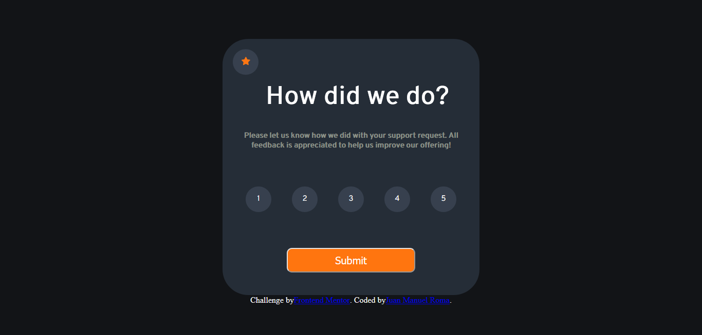
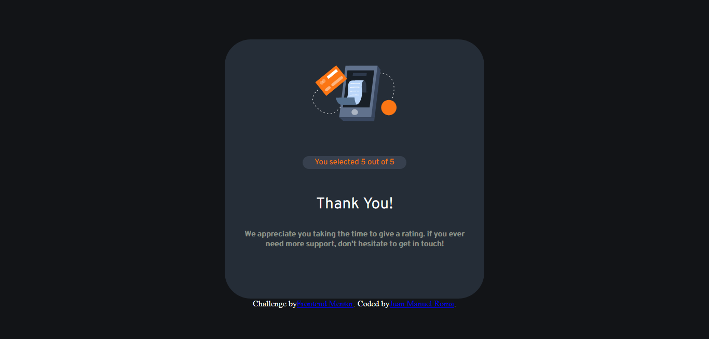

# Frontend Mentor - Interactive rating component solution

This is a solution to the [Interactive rating component challenge on Frontend Mentor](https://www.frontendmentor.io/challenges/interactive-rating-component-koxpeBUmI). Frontend Mentor challenges help you improve your coding skills by building realistic projects. 

## Table of contents

- [Overview](#overview)
  - [The challenge](#the-challenge)
  - [Screenshot](#screenshot)
  - [Links](#links)
- [My process](#my-process)
  - [Built with](#built-with)
  - [What I learned](#what-i-learned)
  - [Continued development](#continued-development)
  - [Useful resources](#useful-resources)
- [Author](#author)

**Note: Delete this note and update the table of contents based on what sections you keep.**

## Overview

### The challenge

Users should be able to:

- View the optimal layout for the app depending on their device's screen size
- See hover states for all interactive elements on the page
- Select and submit a number rating
- See the "Thank you" card state after submitting a rating

### Screenshot






### Links

- Solution URL: [Add solution URL here](https://your-solution-url.com)
- Live Site URL: [Add live site URL here](https://your-live-site-url.com)

## My process

### Built with

- Semantic HTML5 markup
- CSS custom properties
- Flexbox
- CSS Grid
- Mobile-first workflow

### What I learned

To see how you can add code snippets, see below:

This js code was the most difficult part to solve, i've learn how to save data in localStorage, and read it in another page, and clear it on refresh.
Also I create a .forEach to read wich data the user is selecting.

```js
const firstButton = document.getElementById("estrella");
        firstButton.disabled = true;
        localStorage.clear();
        const allStars = document.querySelectorAll('.star');
        allStars.forEach((star, i) => {
          star.addEventListener('click', () => {
            let currentStarLevel = i + 1;
            localStorage.setItem("valor", currentStarLevel);
          });
        });
```

### Continued development

I wanna focus on responsive desing and complex javascripts codes. Add some animations to the web site i've created to make it more visual attractive.

### Useful resources

- [W3school](https://www.w3schools.com/) - This helped me with css and html basics.
- [Chat AI](https://chat.openai.com/) - This is an amazing bot that helps me optimize my code.
- [Stack Overflow](https://stackoverflow.com/) - Amazing forum to clear all my doubts.

## Author

- Website - [Add your name here](https://www.your-site.com)
- Frontend Mentor - [@romajuanmanuel](https://www.frontendmentor.io/profile/romajuanmanuel)

